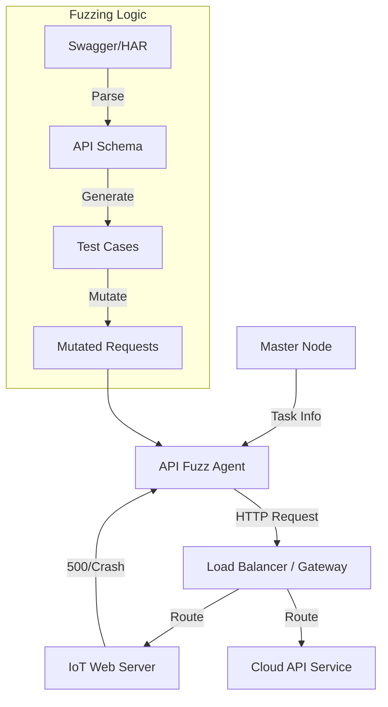

# SF-03: 服务接口模糊测试引擎 (API Fuzzing Engine)

## 1. 简介
针对 IoT 设备的 Web 管理端或 Cloud API 进行 HTTP/RPC Fuzz。相比协议 Fuzz，更关注业务逻辑、参数边界及鉴权绕过。

## 2. 系统上下文

## 3. 详细设计 (SR Detail)

### SR-03-01: OpenAPI/Swagger 解析
*   **功能概述与关键规格**: 
    *   自动读取 `swagger.json` (v2.0) 或 `openapi.yaml` (v3.0+)。
    *   自动生成覆盖所有 Endpoint、Method 及 Content-Type 的测试用例。
*   **实现思路**: 
    *   使用 `schemathesis` 库，它基于 `hypothesis` 属性测试框架。
    *   利用 Property-based Testing 思想，根据 Schema 定义的类型（如 integer, email, uuid）自动生成边界值。
*   **实现设计**:
    *   **Loader**: 支持从 URL 或本地文件加载 Schema。
    *   **Strategy**: 为每个 API Operation 定义 Schema 验证策略，不仅检测 Crash (500)，还检测是否违背了 Response Schema 定义。
*   **接口设计**: 
    *   `load_schema(url_or_path)`
    *   `run_tests(workers=4, headers={...})`
*   **平台约束与周边依赖**: 
    *   **Dependency**: Python 3.10+, `hypothesis`, `schemathesis`。
    *   **Network**: Agent 需能直接访问目标 API 服务。

### SR-03-02: 流量回放变异
*   **功能概述与关键规格**: 
    *   针对无文档的私有 API，通过导入抓包文件 (HAR/PCAP) 进行重放变异。
    *   支持动态 Token 替换，避免因 Session 过期导致 Fuzz 无效。
*   **实现思路**:
    *   **Extraction**: 从 HAR 文件提取 Request 列表。
    *   **Mutation**: 保持 HTTP 结构，仅针对 Body (JSON/XML) 的叶子节点或 Query Params 进行变异。
    *   **Session Maintenance**: 允许用户配置一个 `Login` 接口及 `Token` 提取规则 (Regex/JsonPath)，Fuzzer 定期刷新 Token。
*   **实现设计**:
    *   **Replayer**: 封装 `requests.Session`，自动处理 Keep-Alive。
    *   **Mutator**: 使用 `Radamsa` (二进制变异) 或自定义的 JSON 树变异算法。
*   **接口设计**:
    *   `import_traffic(har_file)`
    *   `set_auth_renewer(login_url, credential, token_pattern)`
*   **平台约束与周边依赖**: 
    *   无特殊 OS 限制，支持 Windows/Linux/macOS。
