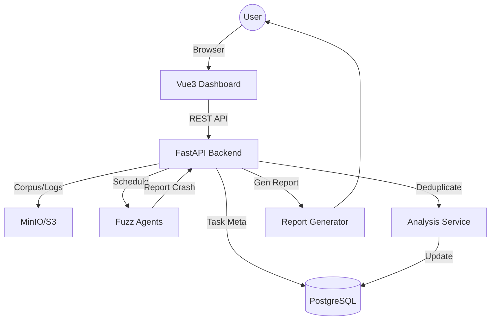

# SF-06: 中央控制与报告中心 (Master Control & Reporting Center)

## 1. 简介
全平台的“大脑”，负责调度资源、管理数据和输出报告。

## 2. 系统上下文

## 3. 详细设计 (SR Detail)

### SR-06-02: Crash 自动归约 (Deduplication)
*   **功能概述与关键规格**: 
    *   基于堆栈指纹 (Stack Hash) 进行去重，准确率 > 95%。
    *   支持区分 "Unique Crash" (新漏洞) 和 "Regression" (旧漏洞复现)。
*   **实现思路**: 
    *   对 Crash Log 中的 Stack Trace 进行标准化处理 (去除地址偏移，保留函数名)，取 Top 3-5 帧计算 SHA256。
*   **实现设计**:
    *   **Normalizer**: 正则替换 `0x[0-9a-f]+` 为 `ADDR`，忽略行号变化。
    *   **Hasher**: `Hash(Frame1 + Frame2 + Frame3)`。
    *   **Triage Logic**:
        *   查询 DB 是否存在该 Hash。
        *   若无 -> Insert New Issue。
        *   若有 -> Update Issue (LastSeenTime, Count++)。
*   **接口设计**: 
    *   `submit_crash(task_id, log_content) -> issue_id`
*   **平台约束与周边依赖**: 
    *   **Database**: 需依赖 PostgreSQL 存储结构化数据。
    *   **Compute**: 归约计算属于 CPU 密集型，建议在 Master 节点独立 Worker 进程处理。

### SR-06-03: 报告生成
*   **功能概述与关键规格**: 
    *   将发现的漏洞汇总为 PDF/HTML 报告。
    *   包含：漏洞摘要、详情、CVSS 评分建议、复现代码 hex dump。
*   **实现思路**: 
    *   使用 `Jinja2` 渲染 HTML 模板，利用 `WeasyPrint` 将 HTML 转为 PDF。
*   **实现设计**:
    *   **Template**: `report_template.html` (Bootstrap 风格)。
    *   **Charts**: 使用 `pyecharts` 或前端生成的图片嵌入报告。
*   **接口设计**:
    *   `generate_report(task_id, format='pdf') -> file_bytes`
*   **平台约束与周边依赖**: 
    *   **OS Libraries**: `WeasyPrint` 依赖 `libcairo2`, `libpango-1.0` 等系统图形库。
    *   **Fonts**: 需预装中文字体 (如 Noto Sans CJK) 以避免报告乱码。
    *   **Docker Reference**: Dockerfile 中需包含 `RUN apt-get install -y libcairo2 libpango-1.0-0`。
