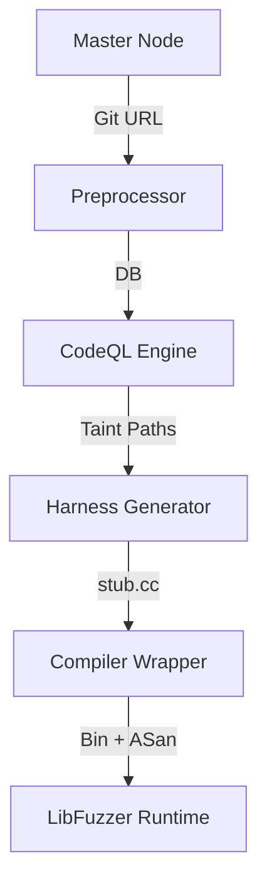

# SF-01: 源码分析与增强引擎 (Source Code Analysis & Enhancement Engine)

## 1. 简介
本模块负责处理具备源码的各组件（如开源解析库、白盒固件），通过静态分析识别攻击面，并自动生成 Fuzz 驱动代码，最大化覆盖率。

## 2. 系统上下文

## 3. 详细设计 (SR Detail)

### SR-01-01: 静态污点分析集成
*   **功能概述与关键规格**: 
    *   集成 CodeQL CLI v2.16+。
    *   针对 C/C++ 代码建立数据库。
    *   关键规格：支持 >100万行代码项目的分析，分析时长控制在Build时长的3倍以内。
*   **实现思路**: 
    *   使用 subprocess 调用 CodeQL 命令行。
    *   编写自定义 `.ql` 查询脚本，定义常见的 IoT 危险函数 Sink (e.g., `system`, `strcpy`) 以及外部输入 Source (e.g., `recv`, `read_file`)。
*   **实现设计**:
    *   **Wrapper**: Python 脚本封装 `codeql database create` 和 `codeql database analyze` 命令。
    *   **Query**: 维护一个 `queries/cpp/taint_tracking.ql` 库。
*   **接口设计**: 
    *   Input: 源码目录路径 + Build Script。
    *   Output: SARIF 格式的 JSON 报告 (包含 source/sink 文件名及行号)。
*   **平台约束与周边依赖**: 
    *   OS: Linux Only (推荐 Ubuntu 22.04)。
    *   依赖: CodeQL CLI binaries, Make/CMake/Ninja 构建工具。

### SR-01-02: Harness 自动生成
*   **功能概述与关键规格**: 
    *   解析 SARIF 报告，提取 Sink 所在函数及其调用链。
    *   生成 LibFuzzer 的 `LLVMFuzzerTestOneInput` 入口函数。
    *   规格：自动生成的 Harness 编译通过率应 > 80%。
*   **实现思路**:
    *   基于 AST 解析找到函数参数类型，使用预定义的“类型-随机数据生成”映射表。
*   **实现设计**:
    *   **Parser**: 解析 SARIF 找到 Sink 函数 `vuln_func(char* buf, int len)`。
    *   **Template**: 使用 Jinja2 模板，生成 C++ 代码，通过 FuzzerDataProvider 填充参数。
*   **接口设计**:
    *   Input: SARIF Report, Source Code.
    *   Output: `harness_generated.cc`.
*   **平台约束与周边依赖**: 
    *   仅支持 C/C++。
    *   某些带复杂结构体指针参数的函数可能难以自动生成，需人工介入。

### SR-01-03: Sanitizer 注入
*   **功能概述与关键规格**: 
    *   构建时自动添加 `-fsanitize=address,undefined` 等编译选项。
    *   支持根据目标平台（x86/ARM/RISC-V）自动适配 Sanitizer 运行时库。
*   **实现思路**: 
    *   通过 Wrapper 劫持 `$CC` / `$CXX` 环境变量或修改 Makefile/CMakeLists.txt 注入 Flag。
*   **实现设计**:
    *   **Compiler Wrapper**: 提供 `fuzz-cc` / `fuzz-cxx` 脚本，内部追加 `-g -O1 -fsanitize=address,fuzzer` 等参数。
    *   **Runtime Linker**: 检测目标架构，如果是交叉编译（如 Android/OpenHarmony），自动指向对应的 `libclang_rt.asan-{arch}.so` 路径。
*   **接口设计**:
    *   CLI Config: `--enable-asan`, `--enable-ubsan`, `--target-arch={x86_64|aarch64|arm}`.
*   **平台约束与周边依赖**: 
    *   **多架构支持**: 需支持 Host (x86) 编译和 Cross-Compile (ARM/OpenHarmony)。对于 OpenHarmony，需使用 `hb` 工具链或 Clang NDK。
    *   **Glibc兼容性**: 针对非标准 Libc (如 musl)，需确认 Sanitizer 库的 ABI 兼容性。
