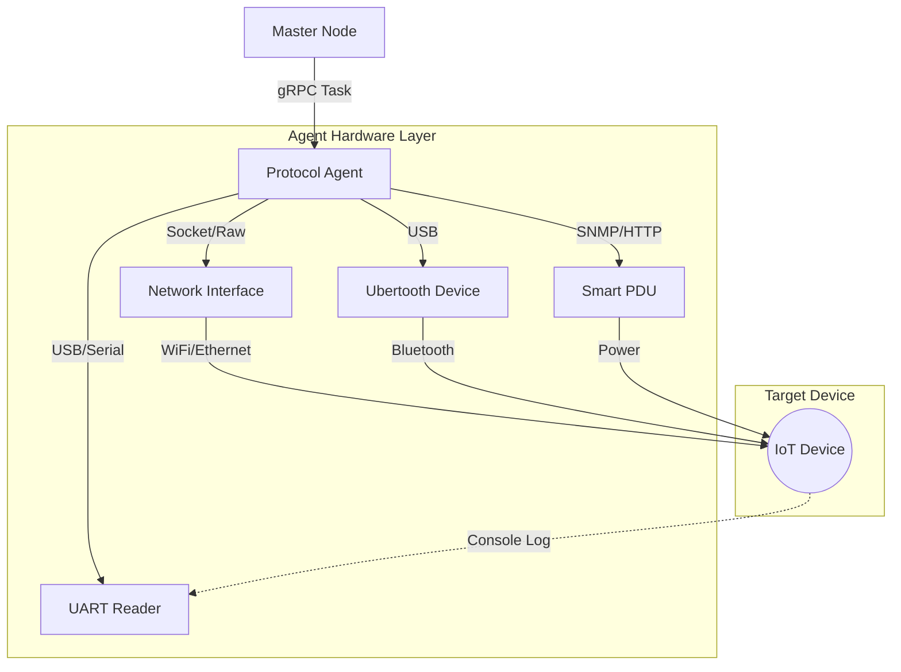

# SF-02: 协议模糊测试代理 (Protocol Fuzzing Agent)

## 1. 简介
针对无源码或黑盒设备，通过网络协议接口进行 Fuzz，重点在于协议状态机的维护和物理层的发包能力。

## 2. 系统上下文

## 3. 详细设计 (SR Detail)

### SR-02-01: 协议解析与状态机
*   **功能概述与关键规格**: 
    *   支持 MQTT 3.1/5.0, CoAP (RFC 7252) 协议的构造与解析。
    *   支持基于图 (Graph-based) 的有状态 Fuzz，深度 >= 5 层交互。
*   **实现思路**: 
    *   基于 **Boofuzz** 框架扩展。它是 Sulley 的现代维护分支，Python 编写，易于扩展。
*   **实现设计**: 
    *   **Protocol Definition**: 为每种协议定义 Class，描述 Block, String, Size, Checksum 等原语。
    *   **State Graph**: 定义 `Session` 图，例如：`Connect -> (Ack) -> Subscribe -> (SubAck) -> Publish`。
    *   **Mutation Strategy**: 仅在特定状态节点 (如 Publish) 开启变异，前序步骤保持固定以通过认证。
*   **接口设计**: 
    *   `register_protocol(name, definition_class)`
    *   `fuzz_target(ip, port, protocol_name, depth_limit)`
*   **平台约束与周边依赖**:
    *   **Host OS**: 推荐 Linux (Kali/Ubuntu)，Windows 下缺少 Raw Socket 支持可能受限。
    *   **Runtime**: **Python 3.10+** (需与 Master Node 及整体项目依赖保持一致)。

### SR-02-02/03: 物理层适配 (WiFi/BLE)
*   **功能概述与关键规格**: 
    *   **WiFi**: 支持 802.11 管理帧 (Auth/Assoc/Beacon) 注入，支持 Monitor 模式。
    *   **BLE**: 支持 BLE 4.0/4.2/5.0 广播包劫持与连接请求 Fuzz。
*   **实现思路**:
    *   **WiFi**: 使用 `Scapy` 的 `Dot11` 层构造帧，绕过 OS 网络栈直接注入无线网卡驱动。
    *   **BLE**: 调用 `ubertooth-tools` 二进制工具或使用 `Scapy` 的 Bluetooth 层。
*   **平台约束与周边依赖**:
    *   **硬件选型检查清单 (Hardware Checklist)**:
        *   **WiFi 网卡**:
            *   [ ] **芯片组支持**: 确认芯片组是否支持 mac80211 软 MAC 架构 (如 Atheros, Ralink, MediaTek)。
            *   [ ] **Monitor Mode**: 运行 `iw list` 检查 `Supported interface modes` 是否包含 `monitor`。
            *   [ ] **Packet Injection**: 运行 `aireplay-ng -9 <interface>` 测试注入成功率 > 80%。
            *   [ ] **驱动兼容性**: 优先选择 Linux Kernel 主线包含驱动的硬件 (免驱)，避免使用需编译闭源驱动的型号。
        *   **BLE 适配器**:
            *   [ ] **Sniffing**: 支持 Promiscuous Mode 抓取广播包。
            *   [ ] **Active**: 支持主动发送/注入 (Injection) 数据包 (许多廉价 Dongle 仅支持被动接收)。
            *   [ ] **API Support**: 具备 Python 绑定库或 CLI 工具集 (如 Ubertooth Tools)。

### SR-02-05: 智能 PDU 控制
*   **功能概述与关键规格**: 
    *   监控设备存活，连续 N 次心跳丢失后执行物理断电重启。
    *   **PDU 功能要求**:
        *   **独立分控**: 必须支持对单个插孔 (Outlet) 独立开关，互不影响。
        *   **程控接口**: 必须支持 SNMP (v2c/v3) 或 HTTP API (REST/Telnet/SSH)。
        *   **响应速度**: 开关动作延迟 < 2秒。
        *   **开放性**: 优先选择有现成 Python 库支持的品牌。
*   **推荐型号与开发方案**:
    1.  **Digital Loggers (DLI) Web Power Switch** (首选推荐)
        *   **定位**: 专业/极客首选，性价比高，社区支持极其丰富。
        *   **控制库**: `dlipower` (Python)。
        *   **安装**: `pip install dlipower`。
        *   **优势**: 专为自动化设计，API 文档详尽。
    2.  **TP-Link Kasa Smart Power Strip** (低成本/轻量级)
        *   **定位**: 消费级，适合预算有限或临时搭建。
        *   **控制库**: `python-kasa`。
        *   **安装**: `pip install python-kasa`。
        *   **优势**: 便宜，易购，无需复杂布线。
        *   **劣势**: 依赖 WiFi 连接稳定性，非工业级可靠性。
    3.  **Synaccess netBooter** (工业/机架式)
        *   **定位**: 数据中心/实验室。
        *   **控制库**: `synlinkpy` 或通过 `telnetlib` 交互。
        *   **优势**: 极其稳定，支持 Telnet/SSH/HTTP 多种协议。
*   **实现思路**: 
    *   在 `infra/hardware/pdu.py` 中实现统一适配器接口 `BasePDU`，封装上述不同库。
