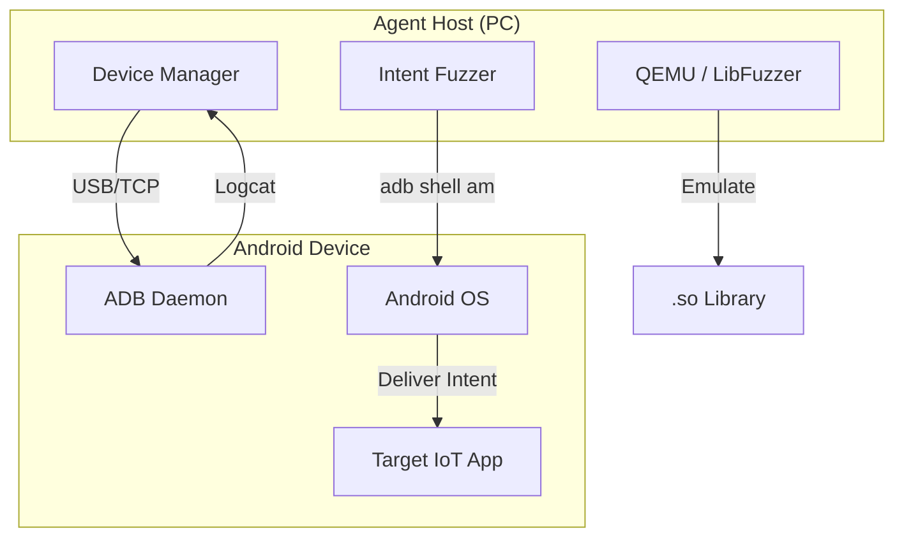

# SF-04: Android 应用测试套件 (Android Fuzzing Suite)

## 1. 简介
针对 IoT 配套 App 的组件暴露 (IPC) 和 Native 库 (JNI) 安全进行测试。

## 2. 系统上下文

## 3. 详细设计 (SR Detail)

### SR-04-01: IPC Fuzzing
*   **功能概述与关键规格**: 
    *   枚举 App 所有 `exported=true` 的 Activity, Service, BroadcastReceiver, ContentProvider。
    *   构造并投递 10,000+ 畸形 Intent，检测 Crash 及权限泄露。
*   **实现思路**: 
    *   解析 `AndroidManifest.xml` (需先反编译或使用 `aapt`)。
    *   基于 `adb shell am start/startservice/broadcast` 命令投递。
*   **实现设计**:
    *   **Manifest Parser**: 使用 `androguard` 解析 APK，提取组件签名及 Permission 要求。
    *   **Generator**: 生成包含空 Action, 超长 Data, 序列化错误 Parcelable 对象的 Intent。
    *   **Monitor**: 另起线程运行 `adb logcat`，正则匹配 `FATAL EXCEPTION`。
*   **接口设计**: 
    *   `scan_components(apk_path)`
    *   `fuzz_component(component_name, duration)`
*   **平台约束与周边依赖**: 
    *   **Host OS**: 支持 Windows/Linux/macOS。
    *   **Device**: 需开启开发者选项和 USB 调试。Android 10+ 可能增加后台启动限制，建议使用 Android 8/9 进行 Fuzz 或 Root 设备移除限制。

### SR-04-03: Native .so Fuzzing
*   **功能概述与关键规格**: 
    *   针对 App JNI 目录下的 `.so` 库进行指令级 Fuzz。
    *   支持 ARM32/ARM64 架构的模拟执行。
*   **实现思路**:
    *   **Mode A (Emulation)**: 使用 `QEMU-User` 运行为 ARM 编译的 Harness，加载目标 .so。
    *   **Mode B (On-Device)**: 编译 Android 版本的 Fuzzer Binary，push 到手机 `/data/local/tmp` 运行。
*   **实现设计**:
    *   **Harness**: 编写 C++ Stub，使用 `dlopen()` 加载目标库，只需模拟 JavaVM 环境 (JNIEnv) 即可调用 JNI 函数。
    *   **Mock**: 如果 .so 依赖 Android 系统特有库 (如 `liblog`), 需提供 Mock 实现或从 system image 提取。
*   **接口设计**:
    *   `generate_jni_harness(so_path, target_function)`
    *   `run_qemu_fuzz(harness_bin, corpus_dir)`
*   **平台约束与周边依赖**: 
    *   **Cross Compilation**: Host 需安装 Android NDK。
    *   **Architecture**: QEMU 模拟效率较低 (约真机 10%~20%)，推荐优先使用真机模式 (On-Device)。
