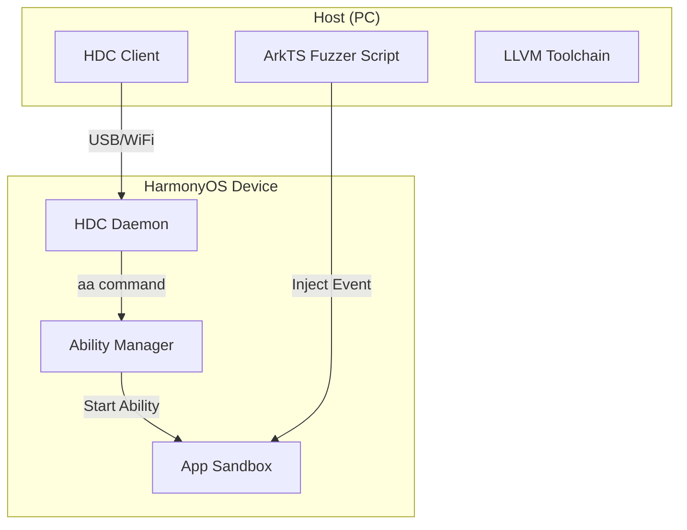

# SF-05: 鸿蒙原生应用测试套件 (HarmonyOS Next Fuzzing Suite)

## 1. 简介
针对纯血鸿蒙 App (HAP) 的安全性测试，适配其特有的 Ability 机制和 ArkTS 语言。

## 2. 系统上下文

## 3. 详细设计 (SR Detail)

### SR-05-02: ArkTS Fuzzing
*   **功能概述与关键规格**: 
    *   针对 UIAbility 和 ExtensionAbility 的入参 (`Want`) 进行 Fuzz。
    *   测试 ArkTS 业务逻辑中的类型检查缺失、空指针异常。
*   **实现思路**:
    *   利用鸿蒙 `hypium` 自动化测试框架 (OpenHarmony 的 UI 测试框架)。
    *   编写测试用例，通过 `FuzzDataProvider` 生成随机数据，构造畸形 `Want` 对象启动 Ability。
*   **实现设计**:
    *   **Test Runner**: 基于 `ohos.test` 包编写 `FuzzTest.ets`。
    *   **Injection**: 使用 `abilityDelegator.startAbility(want)` 发起调用。
*   **接口设计**: 
    *   `generate_fuzz_hap(target_bundle_name)`
    *   `install_and_run(hap_file)`
*   **平台约束与周边依赖**: 
    *   **SDK**: 必须安装 OpenHarmony SDK (API 11+)。
    *   **Language**: 必须使用 ArkTS/TypeScript 编写 Harness。

### SR-05-03: Native Fuzzing (C/C++)
*   **功能概述与关键规格**: 
    *   针对鸿蒙应用中集成的 C/C++ Native 模块 (NAPI) 进行 Fuzz。
    *   支持 LLVM LibFuzzer 模式。
*   **实现思路**:
    *   使用 OpenHarmony NDK 提供的 Clang 编译器，添加 `-fsanitize=fuzzer`。
    *   由于鸿蒙使用了 MUSL Libc，需确保编译链匹配。
*   **实现设计**:
    *   **Build System**: 使用 `hvigor` 或 `CMake` 集成 Fuzz 选项。
    *   **Execution**: 将编译好的 Fuzzer Binary 推送至设备 `/data/local/tmp` 运行 (需申请 `ohos.permission.run_bin` 或在 Debug 模式下)。
*   **接口设计**:
    *   `build_napi_fuzzer(source_dir)`
*   **平台约束与周边依赖**: 
    *   **Device**: 需使用标准系统 (Standard System) 的鸿蒙设备或模拟器。
    *   **Root**: 部分底层 Crash 捕获可能需要 Root 权限读取 `/data/log/faultlog`。
