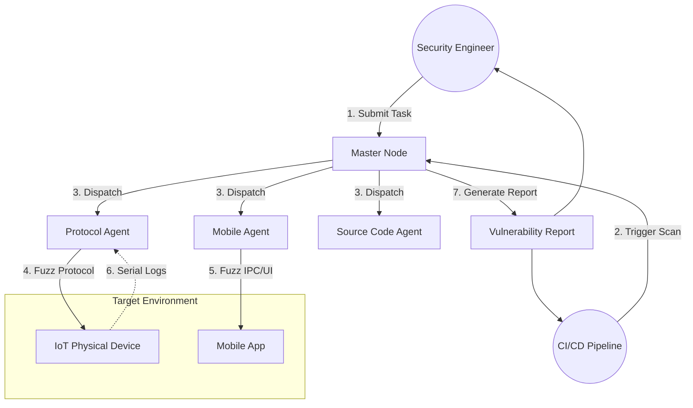

# IoT全流程安全Fuzz工具 High-Level 设计方案

## 1. 架构目标 (Architecture Objectives)
本方案旨在构建一个自动化、覆盖全栈（固件、协议、应用）的IoT安全测试平台，目标如下：
*   **全流程覆盖**: 实现从源码审计、固件Fuzz、通信协议Fuzz到移动端App Fuzz的端到端覆盖。
*   **高度自动化**: 支持从任务下发、环境检测、Fuzz执行、Crash捕获到报告生成的全闭环流程。
*   **异构环境适配**: 兼容 x86/ARM/MIPS 等多架构固件，以及 Android/HarmonyOS/Linux 等多操作系统。
*   **硬件联动**: 深度集成 WiFi/BLE/UART 等硬件外设，实现对物理设备的真实交互测试。

## 2. 系统用例模型 (System Use Case Model)

### 2.1 系统上下文 (Context Diagram)
系统与外部实体（测试人员、被测设备、CI/CD流水线）的交互关系如下：

### 2.2 核心接口描述
*   **User/CI Interface**: 
    *   `POST /api/task`: 提交包含固件包、APK/HAP包或目标IP的测试任务。
    *   `GET /api/report/{id}`: 获取标准化的漏洞分析报告。
*   **Master-Agent Interface (Internal)**:
    *   `gRPC Register()`: 节点上线注册，上报能力（如：具备蓝牙、具备ARM模拟环境）。
    *   `gRPC Heartbeat()`: 状态保活与任务抢占。
    *   `Stream UploadCrash()`: 实时回传 Crash 现场（Coredump, Logcat, PCAP）。

## 3. 关键技术方案设计 (Key Technical Solution Design)

### 3.1 固件源码与污点分析 (Source Code & Taint Analysis)
针对拥有源码的组件，结合静态分析与动态Fuzz。
*   **静态预分析**: 使用 **CodeQL** 提取数据流从 `Source` (如 `recv`, `file_read`) 到 `Sink` (如 `system`, `memcpy`) 的路径。
*   **自动生成 Harness**:依据静态分析的函数签名和依赖关系，自动生成 LibFuzzer 的 Test Harness 代码。
*   **Sanitizer 集成**: 编译时注入 ASan/UBSan，极大提升内存破坏漏洞的检出率。

### 3.2 协议模糊测试 (Protocol Fuzzing)
针对设备对外接口进行黑/灰盒测试。
*   **基于状态机**: 自动推断协议状态（如：连接->认证->功能），避免在无效状态下Fuzz。
*   **物理层适配**: 
    *   **WiFi**: monitor模式注入 802.11 管理帧。
    *   **BLE**: 模拟 Central/Peripheral 角色交互。
*   **设备监控**: 通过 UART/JTAG 监控设备内核日志，结合智能PDU实现“死机-重启-恢复”自动化闭环。

### 3.3 移动端应用 Fuzz (Mobile App Fuzzing)
*   **Android**:
    *   **IPC Fuzz**: 构造畸形 Intent 攻击 Activity/Service/Provider。
    *   **Native Fuzz**: 提取 JNI 库 (`.so`)，使用 QEMU-User 或真机环境运行 LibFuzzer。
*   **HarmonyOS Next**:
    *   **Ability Fuzz**: 针对 UIAbility/ExtensionAbility 的跨应用调用接口测试。
    *   **ArkTS Fuzz**: 生成随机输入测试应用层 ArkTS 接口逻辑。

## 4. 实现架构 (Implementation Architecture)

### 4.1 运行框架 (Runtime Framework)
采用 **Master-Slave 分布式架构**：
*   **Master Node**: 
    *   部署于 Linux Server (Docker化)。
    *   负责任务调度、语料库同步 (Corpus Sync)、去重分析 (Deduplication)。
*   **Agent Nodes**: 
    *   **Protocol Agent**: 运行于 Kali Linux，直通 USB/无线网卡。
    *   **Mobile Agent**: 运行于 Mac/Windows/Linux，连接 Android/HarmonyOS 真机。

### 4.2 通信框架 (Communication Framework)
*   **控制平**: 使用 **gRPC (Protobuf)**，保证强类型约束与高性能。
*   **数据平**: 使用 **Redis** 共享实时语料库，使用 **S3/MinIO** 存储大文件（固件/Crash Dump）。

### 4.3 技术选型 (Technology Stack)
*   **开发语言**: Python 3.10+ (控制逻辑), C/C++ (底层Harness), Go (高并发组件)。
*   **核心引擎**: AFL++, LibFuzzer, Boofuzz, Radamsa。
*   **移动端桥接**: ADB (Android), HDC (HarmonyOS), Frida (动态插桩)。
*   **基础设施**: Docker, Kubernetes (可选扩展), Jenkins (CI集成)。

### 4.4 硬件环境前提 (Hardware Requirements)
*   **无线测试**: Atheros AR9271 (WiFi Monitor), Ubertooth One (BLE)。
*   **设备控制**: 智能PDU (电源控制), USB-TTL (串口日志)。
